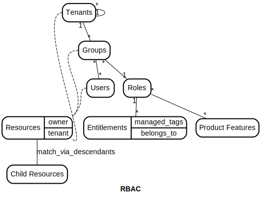
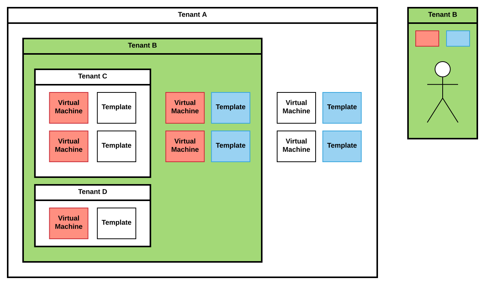
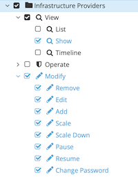

# RBAC


## How it works

RBAC in ManageIQ is split into 2 parts; what you can "see" and what you can "do".

**What you can "see"** is defined as access to resources based on a number of criteria and rules. (Tenancy, Ownership, Entitlements...)

**What you can "do"** is defined by permissions to perform actions. Such permission could be tied to certain kinds of resources. For example - it allows you to specify permission for a user to  edit or delete (actions) Virtual Machines(kind of resource). These are called Product Features in ManageIQ.

At the heart of the RBAC system are Users and Groups. A user can belong to multiple groups, and while a user is interacting with ManageIQ there is the notion of a "current" group. Only the current group's permission set will apply during that session, or until the "current" group is changed. Both a user and a group can directly "own" resources in the system.

A Group belongs to a Tenant. Tenants are a hierarchical structure above groups with inheritance rules for the resources they "own".

A Group is mapped to a Role, and a Role is a collection of a number of Product Features and Entitlements. Product Features are permissions for actions which you can "do" with the system. Entitlements are a set of ways of grouping resources such that a user can "see" them.(Entitlements is just one part from criterias defined by  what you can "see" aspect)




## What you can "see"
There are several possible ways how resources could be accessed by users and there are combinations of those ways.

- **Ownership**

A resource in ManageIQs can be directly owned by a User or Group. A resource can additionally be owned by a tenant. All objects directly owned by a user or owned by the user's current group can be seen.


- **Tenancy**

Tenancy ownership in ManageIQs is determined by first a direct ownership to a resource, and then applying certain "ancestor" or "descendant" rules depending on the type of resource being viewed.




For example, a member of a tenant can only see virtual templates owned by their tenant or owned by any parent tenants. This "ancestor" view is used to allow for sharing a virtual template across multiple child tenants. In contrast, a member of a tenant can only see virtual machine instances owned by their tenant or owned by any child tenants. This "descendant" view is used to allow the parent tenant to do accounting of all running virtual machines instances below them.


- **Entitlements**

Entitlements can be defined in several ways. Those are -

  - managed tags

A user can be given access to various resources by allowing them to view resources that are tagged with a specific tag or set of tags. A user is given access to a "managed tag", and any resource tagged with it can be seen.

  - belongs to

A user can be given access to various resources based on the resource hierarchy from the provider. For example, a user can be given access to a virtual infrastructure Cluster. In doing so, any child host or virtual machine instance that "belongs to" that Cluster can be seen by the user.

These two filters combine together in such a way that if both are specified they constrain each other, otherwise all resources can be seen. That is,

if a managed tag is specified without a belongs to, then all matching tagged resources can be seen
if a belongs to is specified without a managed tag, then all resources in the resource hierarchy can be seen.
if a managed tag is specified with a belongs to, then only matching tagged resources in that resource hierarchy are seen.


- **Match via descendants**

In a resource hierarchy a user may only have access to see the lowest level of resources, but in some instances, particularly for presentation purposes, the parent resources may need to be displayed even though the user does not have access to them directly. For example, the UI may wish to present the folder hierarchy that a virtual machine instance lives under, but the user does not have access to those folders directly. In this case, the UI may request the folders based on a "match via descendant" virtual machines. That is, the user will be given the ability to see only those parent folders of the child virtual machines they can see.

These various ways are combined together in the following expression

```
(ownership OR entitlements OR match_via_descendants) AND tenancy
```

Put into words, a user can see

- resources they directly own or their group directly owns (ownership)
- tagged resources that live within a virtual hierarchy they can see (entitlements)
- parent resources of child resources they can see (match_via_descendants - only used for particular views)
- the above 3 are all filtered by the tenant the user is a part of, and the ancestor/descendant rules for that resource type


## What you can "do"

Permissions(so called Product Features) to perform actions are set in the user's role. Each permission is unique and it pertains to a certain action. For example action “Edit” for Virtual Machines. Usually permissions are tied with some kind of resource (Virtual Machines) but it is not necessary. It can also be used (for example) as an action “View” for a section of settings.

Product Features are hierarchical. It means that some product features could be nodes and others could be leafs. It allows you to control a set of permissions by one root permission.



Example of Product Features in the above tree. “Infrastructure Providers” node product feature represents permissions for infrastructure providers.

When the node product feature is set it means that also its child product features are set.

## Additional Concepts

**Additional Tenancy Sharing (applies to Catalog Items, only)**

Tenancy is controlled by strategies as described above. But sometimes we need to share resources across tenants independently on tenant strategies.

This was added only for Catalog Items and it provides the ability to share the catalog to any tenant.

Then the formula described above looks like:

```
(ownership OR entitlements OR match_via_descendants) AND 
(tenancy OR additional tenancy sharing)
```

**Dynamic Product Features for Tenants**

This concept allows us to enable certain product features (permission) for selected tenants. This is set just for some product features(Manage Quotas,Service Dialog,... ).
Example. Let’s have the permission (product feature) "Manage Quotas" and you want to allow this permission only for some tenants in your organization (root tenant) and you want to use the same role for some reasons.


**Tenancy For Cloud Objects**

It is possible that some providers can have their own tenancy management. Such providers have their own structure of tenants where its resources are spread. In that case we have to pull the provider's tenant hierarchy to ManageIQs (we call them Cloud Tenants) There is a relation between Cloud Tenants and provider's resources and we need to tie that to the tenant hierarchy in ManageIQs so we can leverage provider's tenant hierarchy in ManageIQs. It means that Cloud Tenants are mapped to the tenants in ManageIQs and this process is called Cloud Tenant Mapping. Currently, OpenStack is the only supported provider for this feature.
