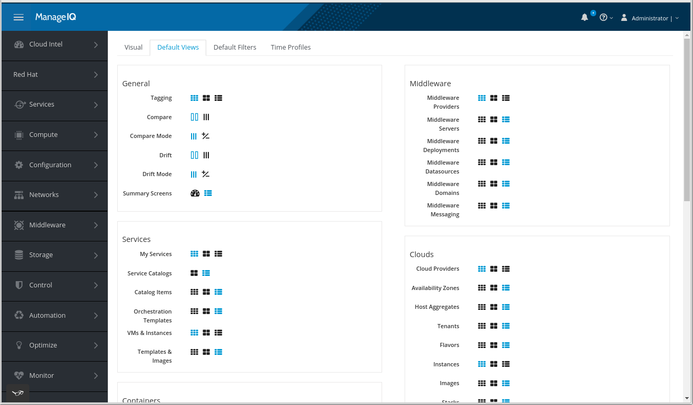

### GTL Lists

GTL stands for Grid, Table, List.

GTL are backed by the [reporting](reports_charts.md) subsystem.

Each GTL screen is fed by report resuts through JSON endpoint `report_data`.
This is supposed to work statelessly however there's some functionality that
uses the session such as search, advanced search and filters.

`report_data` serves data comming throught the `get_view` method in `ApplicationController`. That in
turn loads the appropriate report from the YAML definition stored under `product/views`.

Displaying of GTL data is handled by an Angular component from [ui-components](https://github.com/ManageIQ/ui-components) repository.

*GTL grid in quadicon mode and the view toolbar*

There are 3 modes of display for the GTL component:
 * grid,
 * tile,
 * list.

User can change this in 2 different ways:

 * Configured in the app under **My Settings** ---> **Default View**. These are per-user defaults.
 * View toolbar in the right corner of the screen. These are per-session settings.

*GTL setting under My Setting*

There's a number of exceptions to the behavior:
 * VMs under a Service are always displayed as quadicons.
 * Users and Roles don't have quadicons so they are always displayed as lists even under Tagging.
 * Policy assignment screens display GTLs as quadicons. (ref: https://github.com/ManageIQ/manageiq-ui-classic/pull/3554)
 * ... (problably more, please, document here if you hit into some).

