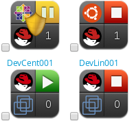

### Quadicons

Quadicons are a condensed graphical way to represent information about various entities and their relations.
Quadicons are present, but not limited to Explorer trees, GTLs and Listnavs.

Example: 4 VM quadicons:


The definition of quadicons is stored as methods in model decorators under the `app/decorators` folder.
The format allows you to specify either a single quadrant large icon, or four small ones (see the examples below).
Ideally each new model that gets displayed in a GTL should have a `quadicon` method defined.

```ruby
def quadicon # icon with four quadrants
  {
    :top_left => {
      :fonticon => 'fa fa-play',
      :color   => 'green',
      :tooltip => 'some tooltip'
    },
    :top_right => {
      :fileicon => '/assets/svg/something.svg',
      :tooltip => 'some other tooltip'
    },
    :bottom_left => {
      :text => 'T',
      :background => 'blue',
      :tooltip => 'you should put tooltips on each quad'
    },
    :bottom_right => {
      :text => '4000004',
      :tooltip => 'numbers will be shortened using numeral.js'
    }
  }
end

def quadicon # one large icon
  {
    :fileicon => '/assets/svg/something.svg',
    :tooltip => 'hello world'
  }
end
```

It's not recommended to use too much inheritance between decorators, because there might be side effects and we would like to have everything as explicit as possible. Any common behavior that affects all of the quadicons should be moved into a static method in `app/helpers/quadicon_helper.rb`, see `QuadiconHelper.machine_state` as an example.

Old quadicon implementation lives in (obsolete) [ui-components repository](https://github.com/ManageIQ/ui-components). The new one lives in `Quadicon` component under the [react-ui-components](https://github.com/ManageIQ/react-ui-components/tree/master/src/quadicon).
