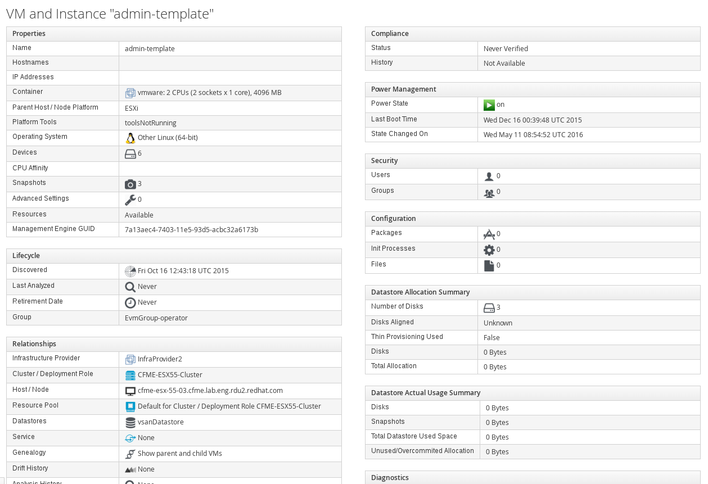

### Textual Summary

Textual summaries display details about a selected entity (such as VM, Host,
Network, Cluster, Container etc.) and also related entities (Snapshots for VM,
Hardware for Host etc.).



Textual summaries consist of groups of related information and each group consist of properties.

In a controller a list of textual groups is declared:

```
class CloudNetworkController < ApplicationController

...

  private

  def textual_group_list
    [%i(properties relationships), %i(tags)]
  end
  helper_method :textual_group_list
end
```

Definition of each group can found in modules named according to scheme
`XxxHelper::TextualSummary` in `app/helpers/*_helper/textual_summary.rb`.

Example group definition:
```
def textual_group_power_management
  TextualGroup.new(_("Power Management"), %i(power_state boot_time state_changed_on))
end

```

The group definition consists of a formatter -- `TextualGroup`, a label and a list of properties.

Other formatters include `TextualMultilabel` and `TextualTags`. All formatters live under `src/textual_summary` in [react-ui-components repository](https://github.com/ManageIQ/react-ui-components/tree/master/src/textual_summary).

Example property definitions:
```
  def textual_vapp
    {:label => _("vApp"), :value => @record.vapp}
  end

  def textual_aggregate_cpu_total_cores
    {:label => _("Total %{title} CPU Cores") % {:title => title_for_host},
     :value => number_with_delimiter(@record.aggregate_cpu_total_cores)}
  end

  def textual_aggregate_cpu_memory
    {:label => _("Total %{title} Memory") % {:title => title_for_host},
     :value => number_to_human_size(@record.aggregate_memory.megabytes, :precision => 0)}
  end
```
